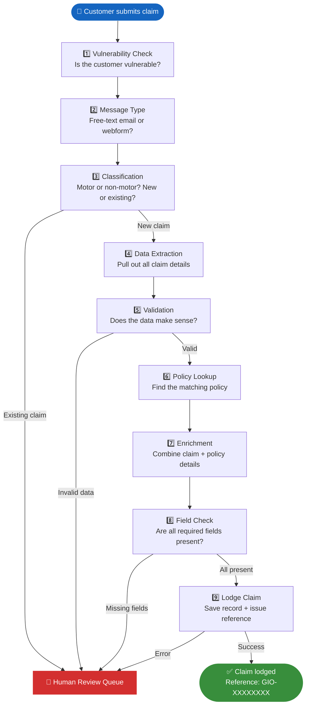

# The Claim Journey

This page walks through exactly what happens, step by step, from the moment
a customer's email or webform submission arrives.

---

## Overview

---

## Step by step

### Step 1 — Vulnerability check

**What happens:** The system scans the email for phrases associated with
customer vulnerability — such as financial hardship, recent bereavement,
domestic situations, or health challenges.

**Why it matters:** If vulnerability indicators are found, the claim is still
processed automatically, but the claim record is **flagged** so that the
assigned claims handler knows to approach the customer with extra care.

**Result:** A vulnerability flag is either set or not set. It does not stop the claim.

---

### Step 2 — Message type identification

**What happens:** The system determines whether the message was written freely
by the customer or generated by an online webform.

**Why it matters:** Webforms have a predictable structure (labelled fields),
while free-text emails need a different reading approach. This distinction
helps the system be more accurate in the next step.

---

### Step 3 — Classification

**What happens:** The AI reads the email and answers two questions:

- Is this a **motor** claim (car accident) or a **non-motor** claim (home, travel, etc.)?
- Is this a **new claim** or an **update** to an existing one?

**Why it matters:**

- **New claim** → the pipeline continues automatically
- **Existing claim update** → immediately sent to a human reviewer
  (existing claims require careful merging with open records)

---

### Step 4 — Data extraction

**What happens:** The AI reads the full email and extracts every relevant piece
of information into a structured record:

- Policy holder name and contact details
- Policy number
- Vehicle details (for motor claims)
- Incident date, description, and location
- Third-party details (if applicable)

This is the equivalent of manually filling in a claim form from the email.

---

### Step 5 — Validation

**What happens:** A set of automatic rules check the extracted data for consistency:

- Is the incident date in the past? *(It cannot be in the future)*
- Is all the most critical information present?
- Does the policy number match one of our known policy formats?

If validation fails, the claim goes to human review with a clear note explaining why.

---

### Step 6 — Policy lookup

**What happens:** The system searches for the customer's policy record using the
policy number extracted in Step 4.

If a matching policy is found, it proceeds. If not, the claim continues but is
flagged — the field check in Step 8 will catch any resulting gaps.

---

### Step 7 — Enrichment

**What happens:** The extracted claim data and the matched policy record are
combined into a single, complete record. This adds policy-level details such as:

- The insurance brand (GIO or AMI)
- The product type (e.g. Motor Comprehensive)
- The excess amount
- The sum insured

---

### Step 8 — Field check

**What happens:** The system confirms that every **mandatory field** is present
in the combined record before lodgement.

For motor claims, mandatory fields include:

- Policy number
- Incident date
- Incident description
- Vehicle registration

If any required field is missing, the claim goes to human review with a list
of exactly which fields are absent.

---

### Step 9 — Lodge

**What happens:** The completed, validated claim record is saved, and a unique
reference number is issued (e.g. `GIO-A3F72B1D`).

This reference number is the official identifier for the claim going forward.
From this point, the claim exists in the system and can be actioned by the claims team.

---

## Typical end-to-end time

| Stage                               | Typical duration |
| ----------------------------------- | ---------------- |
| Steps 1–3 (scan + classify)         | < 3 seconds      |
| Step 4 (extraction)                 | 3–8 seconds      |
| Steps 5–9 (validate, enrich, lodge) | < 1 second       |
| **Total**                           | **< 12 seconds** |
