# Data Flow & State

## The `GraphState` contract

Every node in the pipeline receives the **entire** `GraphState` dict and returns a **partial update** dict.
LangGraph merges updates into the state automatically. Nodes must never mutate the incoming state object.

```python
# Pattern every node follows:
async def my_node(state: GraphState) -> dict:
    # Read from state
    value = state.get("some_field")
    # ... do work ...
    # Return ONLY the fields this node owns
    return {"my_field": result}
```

---

## Node-by-node state flow

The table below traces which fields are **read** (inputs) and **written** (outputs) by each node.

| Node                  | Reads                                                               | Writes                                                            |
| --------------------- | ------------------------------------------------------------------- | ----------------------------------------------------------------- |
| `vulnerability_check` | `email_body`                                                        | `vulnerability_flag`, `vulnerability_tags`, `vulnerability_score` |
| `classify_email`      | `email_body`, `raw_files`                                           | `email_type`                                                      |
| `classify`            | `email_body`, `email_type`                                          | `insurance_type`, `claim_status`, `claims`                        |
| `extract_data`        | `email_body`, `raw_files`, `email_type`, `insurance_type`, `claims` | `extracted_claim`                                                 |
| `verify`              | `extracted_claim`, `vulnerability_flag`                             | `verification_result`, `verification_errors`                      |
| `policy_retrieval`    | `extracted_claim`                                                   | `policy`, `policy_found`                                          |
| `enrich`              | `extracted_claim`, `policy`                                         | `enriched_claim`                                                  |
| `check_fields`        | `enriched_claim`, `insurance_type`                                  | `fields_complete`, `missing_fields`                               |
| `lodge`               | `enriched_claim`, `vulnerability_flag`, `email_id`                  | `claim_reference`, `lodge_status`                                 |
| `exception_handler`   | `error_reason`, `error_node`, entire state                          | `exception_record`, `error_reason`, `completed`                   |

---

## Full state machine diagram

```mermaid
stateDiagram-v2
    direction LR
    [*] --> vulnerability_check : START (email_id, email_body, raw_files)

    vulnerability_check --> classify_email : always

    classify_email --> classify : always

    classify --> extract_data : claim_status == new_claim
    classify --> exception_handler : claim_status == existing_claim

    extract_data --> verify : always

    verify --> policy_retrieval : verification_result in (PASS, WARN)
    verify --> exception_handler : verification_result == FAIL

    policy_retrieval --> enrich : always

    enrich --> check_fields : always

    check_fields --> lodge : fields_complete == True
    check_fields --> exception_handler : fields_complete == False

    lodge --> [*] : lodge_status == SUCCESS
    lodge --> exception_handler : lodge_status == FAILED

    exception_handler --> [*] : always
```



---

## State field reference

### Input fields (set by `run.py` / caller)

| Field        | Type         | Description                                                               |
| ------------ | ------------ | ------------------------------------------------------------------------- |
| `email_id`   | `str`        | Unique identifier for this submission                                     |
| `email_body` | `str`        | Full plain-text body of the email or webform                              |
| `raw_files`  | `list[dict]` | Parsed attachments: `{filename, mime_type, text_content, base64_content}` |

### Vulnerability fields

| Field                 | Type        | Set by                | Description                                 |
| --------------------- | ----------- | --------------------- | ------------------------------------------- |
| `vulnerability_flag`  | `bool`      | `vulnerability_check` | `True` if customer is considered vulnerable |
| `vulnerability_tags`  | `list[str]` | `vulnerability_check` | Matched vulnerability phrases               |
| `vulnerability_score` | `float`     | `vulnerability_check` | 0.0–1.0 severity score                      |

### Classification fields

| Field            | Type         | Set by           | Description                                        |
| ---------------- | ------------ | ---------------- | -------------------------------------------------- |
| `email_type`     | `str`        | `classify_email` | `"freetext"` or `"webform"`                        |
| `insurance_type` | `str`        | `classify`       | `"motor"`, `"non-motor"`, or `"undetermined"`      |
| `claim_status`   | `str`        | `classify`       | `"new_claim"` or `"existing_claim"`                |
| `claims`         | `list[dict]` | `classify`       | One `ClaimContext` per distinct claim in the email |

### Extraction & verification

| Field                 | Type           | Set by         | Description                           |
| --------------------- | -------------- | -------------- | ------------------------------------- |
| `extracted_claim`     | `dict \| None` | `extract_data` | `ExtractedClaim.model_dump()`         |
| `verification_result` | `str`          | `verify`       | `"PASS"`, `"WARN"`, or `"FAIL"`       |
| `verification_errors` | `list[str]`    | `verify`       | Human-readable error/warning messages |

### Policy & enrichment

| Field            | Type           | Set by             | Description                             |
| ---------------- | -------------- | ------------------ | --------------------------------------- |
| `policy`         | `dict \| None` | `policy_retrieval` | Raw policy record from JSON store       |
| `policy_found`   | `bool`         | `policy_retrieval` | Whether a policy was matched            |
| `enriched_claim` | `dict \| None` | `enrich`           | Merged extracted claim + policy details |

### Lodgement

| Field             | Type          | Set by         | Description                             |
| ----------------- | ------------- | -------------- | --------------------------------------- |
| `fields_complete` | `bool`        | `check_fields` | All mandatory fields present            |
| `missing_fields`  | `list[str]`   | `check_fields` | Names of any missing mandatory fields   |
| `claim_reference` | `str \| None` | `lodge`        | `GIO-XXXXXXXX` hex reference            |
| `lodge_status`    | `str`         | `lodge`        | `"SUCCESS"`, `"FAILED"`, or `"PENDING"` |

### Error tracking

| Field              | Type           | Set by              | Description                                    |
| ------------------ | -------------- | ------------------- | ---------------------------------------------- |
| `error_reason`     | `str \| None`  | Any node            | Human-readable reason for routing to exception |
| `error_node`       | `str \| None`  | Any node            | Name of the node that set the error            |
| `exception_record` | `dict \| None` | `exception_handler` | Full record written to exception queue         |
| `completed`        | `bool`         | `exception_handler` | Marks terminal state                           |

---

## Data transformation walkthrough

### Motor claim — happy path

```
email_body: "Hi, I had a car accident on 5 Jan 2025. Policy GIO-M-001..."
                │
                ▼
vulnerability_check:  0 keyword hits → flag=False, score=0.0
                │
                ▼
classify_email:  LLM → email_type="freetext"
                │
                ▼
classify:        LLM → insurance_type="motor", claim_status="new_claim"
                 LLM → claims=[{description:"car accident", risk:"motor", ...}]
                │
                ▼
extract_data:    LLM → ExtractedClaim {
                   insured_details.policy_number = "GIO-M-001"
                   incident_details.date_of_loss = "2025-01-05"
                   vehicle_information.vehicle_registration = "ABC123"
                   ...
                 }
                │
                ▼
verify:          date_of_loss in past ✓, policy prefix "GIO" ✓
                 → verification_result="PASS"
                │
                ▼
policy_retrieval: lookup "GIO-M-001" → policy={holder:"Jane Smith", ...}
                │
                ▼
enrich:          merge extracted_claim + policy
                 → enriched_claim = { ...all fields... }
                │
                ▼
check_fields:    all mandatory fields present → fields_complete=True
                │
                ▼
lodge:           write to lodged_claims.jsonl
                 → claim_reference="GIO-A3F72B1D", lodge_status="SUCCESS"
```

### Existing claim — exception path

```
classify: claim_status="existing_claim"
    │
    ▼ (conditional edge)
exception_handler:
    error_reason = "Existing claim — routed to manual review"
    write to exceptions_queue.jsonl
    completed = True
```
