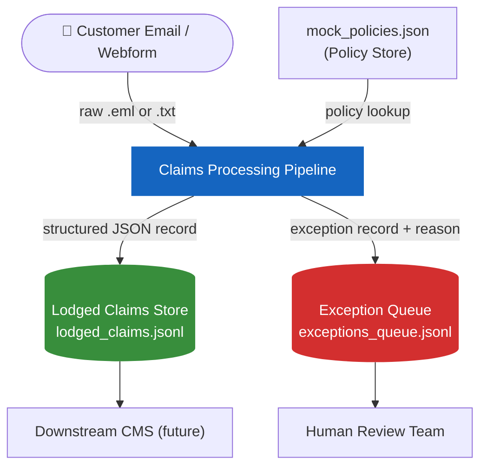

# High-Level Design

## System context

The Claims Processing Pipeline sits between the **insurer's inbound communication channels**
(email, webform) and the **downstream claims management system** (CMS).
Its job is to transform unstructured, free-text customer messages into validated, structured
claim records — automatically and without human data-entry for the happy path.



---

## Component overview

| Component                 | Technology                                | Responsibility                                            |
| ------------------------- | ----------------------------------------- | --------------------------------------------------------- |
| **Pipeline Orchestrator** | LangGraph `StateGraph`                    | Executes the 10-node graph, manages conditional routing   |
| **LLM Layer**             | LangChain `ChatVertexAI` (Gemini 1.5 Pro) | Structured extraction, classification, confirmation       |
| **Schemas**               | Pydantic v2                               | Defines and validates all LLM I/O contracts               |
| **Config**                | pydantic-settings                         | Reads env vars / `.env`, validates, type-coerces          |
| **File Parser**           | `services/file_parser.py`                 | Parses `.eml` files, extracts MIME parts and attachments  |
| **Vulnerability Scanner** | `services/vulnerability_scanner.py`       | Keyword scan over `vulnera_phrases.csv`                   |
| **Policy Store**          | `data/mock_policies.json`                 | 15 sample policies (dev); production points to real CMS   |
| **Claims Store**          | `data/lodged_claims.jsonl`                | Append-only JSONL file for lodged claims                  |
| **Exception Queue**       | `data/exceptions_queue.jsonl`             | Append-only JSONL file for routed exceptions              |
| **CLI**                   | `run.py`                                  | Developer entry point; `--input`, `--pretty`, `--fixture` |

---

## Deployment (current)

The system runs as a **single Python process** invoked via the CLI or an event consumer.  
It has **no inbound HTTP server** — it is designed to be embedded in a Kafka/Redpanda consumer
or called directly by an orchestration layer.

```
                 ┌──────────────────────────────────────────────────┐
                 │  Python Process (single binary / container)       │
                 │                                                    │
  .eml / .txt ──►│  run.py ──► pipeline.ainvoke() ──► result dict   │──► lodged_claims.jsonl
                 │                     │                              │
                 │                     └──(exception)──────────────  │──► exceptions_queue.jsonl
                 │                                                    │
                 │  GCP Vertex AI (Gemini) ◄── LLMClient             │
                 └──────────────────────────────────────────────────┘
```

### Future target architecture

```
Kafka Topic: claims.inbound
        │
        ▼
  Consumer Service ──► Pipeline (this repo) ──► Kafka Topic: claims.lodged
                                          └───► Kafka Topic: claims.exceptions
```

---

## Technology choices rationale

| Decision        | Chosen                       | Reason                                                    |
| --------------- | ---------------------------- | --------------------------------------------------------- |
| Orchestration   | LangGraph                    | Stateful graph execution, conditional edges, native async |
| LLM             | Gemini 1.5 Pro via Vertex AI | Multimodal (images, PDFs), enterprise GCP auth            |
| Data validation | Pydantic v2                  | Industry standard, fast, JSON schema generation           |
| Configuration   | pydantic-settings            | `.env` + env var unification with type safety             |
| Primary linter  | ruff                         | Single tool replacing flake8 + isort + black              |
| Testing         | pytest + pytest-asyncio      | Async-first from day zero                                 |

See [Architecture Decisions (ADRs)](decisions.md) for the full reasoning behind each choice.

---

## Security considerations

- **No hardcoded credentials** — all GCP config via env vars or Workload Identity
- **`.env` is gitignored** — `.env.example` is committed as a template
- **Service account keys** (`service_account*.json`, `*.pem`) are gitignored
- **Sensitive output files** (`lodged_claims.jsonl`, `exceptions_queue.jsonl`) are gitignored
- **detect-secrets** pre-commit hook prevents accidental credential commits
- **`MOCK_LLM=true`** mode makes zero external calls — safe for CI and offline development
