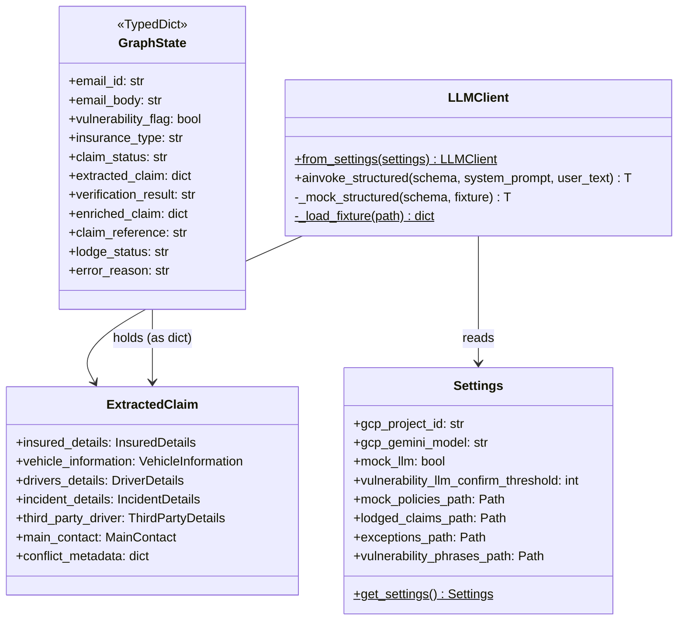

# Low-Level Design

## Package structure

```
app_classify_extract_claim/
├── __init__.py
├── config/
│   ├── __init__.py
│   └── settings.py          ← Settings(BaseSettings), get_settings() singleton
├── data/
│   ├── mock_policies.json   ← dev-only policy records
│   ├── vulnera_phrases.csv  ← phrase, category, severity_weight columns
│   ├── lodged_claims.jsonl  ← runtime, gitignored
│   └── exceptions_queue.jsonl  ← runtime, gitignored
├── graph/
│   ├── __init__.py
│   ├── builder.py           ← build_graph() factory
│   ├── state.py             ← GraphState TypedDict + initial_state()
│   └── nodes/
│       ├── __init__.py
│       ├── vulnerability_check.py
│       ├── classify_email.py
│       ├── classify.py
│       ├── extract_data.py
│       ├── verify.py
│       ├── policy_retrieval.py
│       ├── enrich.py
│       ├── check_fields.py
│       ├── lodge.py
│       └── exception_handler.py
├── prompts/
│   ├── __init__.py
│   ├── classify_prompts.py
│   ├── extract_prompts.py
│   └── vulnerability_prompts.py
├── schemas/
│   ├── __init__.py
│   └── claim_data.py
├── services/
│   ├── __init__.py
│   ├── file_parser.py
│   ├── llm_client.py
│   └── vulnerability_scanner.py
├── tests/
│   ├── conftest.py
│   ├── test_integration.py
│   ├── test_nodes/
│   │   └── test_*.py  (10 files)
│   └── sample_data/
│       ├── *.eml / *.txt  (8 input files)
│       ├── mock_llm_responses_*.json  (8 fixture files)
│       └── README.md
├── run.py
├── pyproject.toml
├── Makefile
└── mkdocs.yml
```

---

## Module responsibilities

### `config/settings.py`

Singleton `Settings` instance backed by **pydantic-settings** `BaseSettings`.
Reads from environment variables (case-insensitive) and an optional `.env` file.
Exposed via the `get_settings()` function which caches the instance on first call.

Key concerns:
- All paths are `pathlib.Path` objects — nodes never do raw string path joins
- `log_level` is forced uppercase via `@field_validator`
- `extra="ignore"` prevents `ValidationError` on unexpected env vars (e.g. system vars)

### `graph/state.py`

Defines `GraphState` as a `TypedDict` with `total=False` — all fields are optional
so any node can safely call `state.get("field")` without `KeyError`.

`initial_state()` provides a fully-populated default state to guarantee deterministic
defaults regardless of which optional fields a test or caller omits.

### `graph/builder.py`

`build_graph()` constructs the LangGraph `StateGraph`, registers all 10 nodes,
adds linear and conditional edges, and compiles the graph.

The four conditional edge functions (`_after_classify`, `_after_verify`,
`_after_check_fields`, `_after_lodge`) are co-located with the builder because
they encode routing logic that is intrinsic to graph topology, not node business logic.

### `graph/nodes/`

Each file exposes a single async function `async def node_name(state: GraphState) -> dict`.
Nodes are **pure in terms of side effects** except for:
- `lodge.py` — appends to `lodged_claims.jsonl`
- `exception_handler.py` — appends to `exceptions_queue.jsonl`

All other nodes are side-effect-free during the happy path.

### `services/llm_client.py`

`LLMClient` wraps `ChatVertexAI` and exposes:

```python
async def ainvoke_structured(
    self,
    schema: type[T],      # Pydantic model class
    system_prompt: str,
    user_text: str,
    images: list[str] | None = None,
) -> T:
```

When `MOCK_LLM=true`, `_mock_structured()` is called instead of the real LLM.
When `MOCK_LLM_FIXTURE` is set, responses are loaded from the fixture JSON by `schema.__name__`.

### `services/vulnerability_scanner.py`

Two public functions:

```python
def scan(text: str, csv_path: str) -> list[str]:
    """Return list of matched vulnerability phrases."""

def compute_score(matched: list[str], confirmed: bool) -> float:
    """Compute 0.0–1.0 severity score from phrase weights."""
```

The CSV has columns: `phrase`, `category`, `severity_weight` (0.0–1.0).

### `prompts/`

Each file exposes functions that return `(system_prompt: str)` strings.
Prompt content is versioned alongside code — there is no external prompt registry.
This keeps the prompt→schema contract auditable via `git blame`.

---

## Class diagram (key types)



---

## Async execution model

All 10 node functions are `async def` and use `await` for:
- `LLMClient.ainvoke_structured()` — single Vertex AI call per node
- File I/O in `lodge.py` and `exception_handler.py` (standard `open()`, sync, acceptable at this scale)

The top-level call is:
```python
result = await graph.ainvoke(initial_state(...))
```

`asyncio.run()` handles the event loop in `run.py`.
No internal concurrency (fan-out) is used within nodes — LangGraph supports this
but is not needed given the linear nature of the current pipeline.

---

## Error handling strategy

| Layer                     | Strategy                                                                                                                                                                                     |
| ------------------------- | -------------------------------------------------------------------------------------------------------------------------------------------------------------------------------------------- |
| **Node-level**            | Each node wraps its logic in `try/except Exception`. On error, it sets `error_reason` and `error_node` in the returned dict, allowing LangGraph to continue and route to `exception_handler` |
| **Conditional edges**     | Check `error_node` in addition to domain fields so any unhandled node error is caught at routing time                                                                                        |
| **`exception_handler`**   | Terminal node — writes to exceptions queue, sets `completed=True`, always routes to `END`                                                                                                    |
| **`vulnerability_check`** | Special case: returns `flag=False` on LLM error (fail-safe, not fail-open)                                                                                                                   |
| **`verify`**              | Returns `FAIL` on `None` extracted_claim — prevents null propagation                                                                                                                         |
