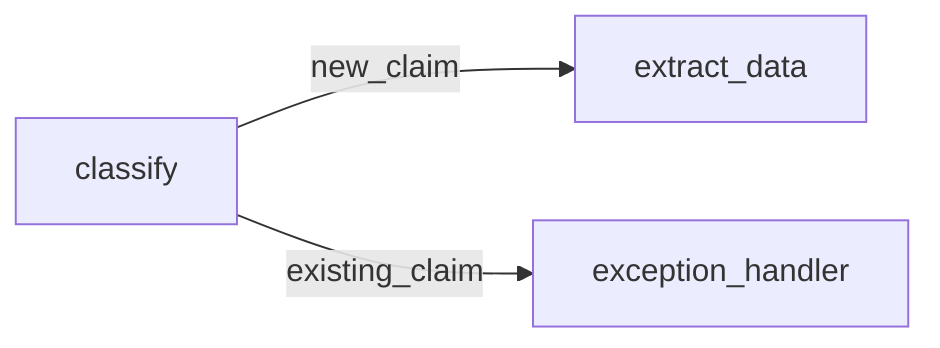

# classify

**File:** `graph/nodes/classify.py`  
**Position:** Node 3  
**LLM calls:** 2  
**Branches:** → `exception_handler` if `claim_status == "existing_claim"`

---

## Purpose

Make two key determinations about the claim:

1. **Insurance type** — is this a motor or non-motor claim?
2. **Claim status** — is this a new claim, or an update to an existing one?

Additionally, group the email content into distinct **claim contexts** if the email
contains multiple separate incidents or items (e.g., two damaged vehicles).

---

## Routing decision



Existing claim updates are **not** processed automatically — they require human
review to merge into the existing record correctly.

---

## State contract

|            | Field            | Type         | Description                                |
| ---------- | ---------------- | ------------ | ------------------------------------------ |
| **Reads**  | `email_body`     | `str`        | Full email body                            |
| **Reads**  | `email_type`     | `str`        | From `classify_email`                      |
| **Writes** | `insurance_type` | `str`        | `"motor"`, `"non-motor"`, `"undetermined"` |
| **Writes** | `claim_status`   | `str`        | `"new_claim"` or `"existing_claim"`        |
| **Writes** | `claims`         | `list[dict]` | One `ClaimContext` per distinct claim      |

---

## LLM schemas

```python
class InsuranceTypeResponse(BaseModel):
    insurance_type: Literal["motor", "non-motor", "undetermined"]

class ClaimStatusResponse(BaseModel):
    claim_type: Literal["new_claim", "existing_claim"]

class ClaimsGroupingResponse(BaseModel):
    claims: list[ClaimContext]

class ClaimContext(BaseModel):
    description: str
    risk: str
    unique_email_info: str
    attachments: list[str]
```

---

## API reference

::: app_classify_extract_claim.graph.nodes.classify
    options:
      show_source: true
      members:
        - classify
