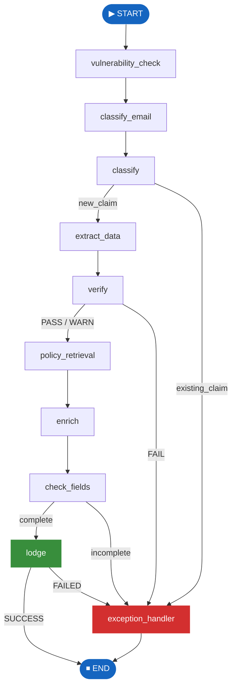

# Node Catalogue

The pipeline consists of **10 nodes** executed in a directed acyclic graph.  
Each node is an `async def` function that accepts the full `GraphState` and returns a partial update dict.

---

## Pipeline graph



---

## Node summary

| #   | Node                                          | LLM calls            | Branches                            | Key output field                  |
| --- | --------------------------------------------- | -------------------- | ----------------------------------- | --------------------------------- |
| 1   | [vulnerability_check](vulnerability_check.md) | 0 or 1 (conditional) | None                                | `vulnerability_flag`              |
| 2   | [classify_email](classify_email.md)           | 1                    | None                                | `email_type`                      |
| 3   | [classify](classify.md)                       | 2                    | → `exception_handler` if existing   | `insurance_type`, `claim_status`  |
| 4   | [extract_data](extract_data.md)               | 1                    | None                                | `extracted_claim`                 |
| 5   | [verify](verify.md)                           | 0                    | → `exception_handler` if FAIL       | `verification_result`             |
| 6   | [policy_retrieval](policy_retrieval.md)       | 0                    | None                                | `policy`, `policy_found`          |
| 7   | [enrich](enrich.md)                           | 0                    | None                                | `enriched_claim`                  |
| 8   | [check_fields](check_fields.md)               | 0                    | → `exception_handler` if incomplete | `fields_complete`                 |
| 9   | [lodge](lodge.md)                             | 0                    | → `exception_handler` if FAILED     | `claim_reference`, `lodge_status` |
| 10  | [exception_handler](exception_handler.md)     | 0                    | Terminal                            | `exception_record`, `completed`   |

---

## Implementing a new node

1. Create `graph/nodes/my_node.py` following the template:

    ```python
    """Node: my_node — brief description."""
    from __future__ import annotations
    import logging
    from app_classify_extract_claim.graph.state import GraphState

    logger = logging.getLogger(__name__)

    async def my_node(state: GraphState) -> dict:
        try:
            value = state.get("some_input_field")
            # ... logic ...
            return {"my_output_field": result}
        except Exception as exc:
            logger.error("my_node failed: %s", exc, exc_info=True)
            return {"error_reason": str(exc), "error_node": "my_node"}
    ```

2. Register in `graph/builder.py`:

    ```python
    from app_classify_extract_claim.graph.nodes.my_node import my_node
    builder.add_node("my_node", my_node)
    builder.add_edge("previous_node", "my_node")
    ```

3. Add the corresponding state fields to `graph/state.py`
4. Add a Pydantic schema to `schemas/claim_data.py` if your node calls the LLM
5. Write a test file `tests/test_nodes/test_my_node.py`
